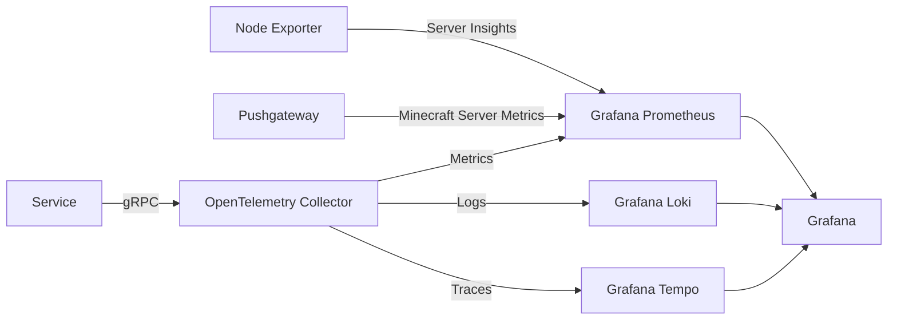

# Metrics

When possible/necessary, services on Kratos will report to the metrics stack.

Where `Service` is any service running on Kratos, that may or may not emit all of the possible types of data.

## Definitions

* [OpenTelemetry Collector](https://opentelemetry.io/docs/collector/): The OpenTelemetry Collector offers a vendor-agnostic implementation of how to receive, process and export telemetry data.
* [Node Exporter](https://github.com/prometheus/node_exporter): Prometheus exporter for hardware and OS metrics exposed by *NIX kernels.
* [Prometheus Pushgate](https://github.com/prometheus/pushgateway): The Prometheus Pushgateway exists to allow ephemeral and batch jobs to expose their metrics to Prometheus.
* [Grafana Prometheus](https://github.com/grafana/prometheus): Prometheus is a systems and service monitoring system. It collects metrics from configured targets at given intervals.
* [Grafana Loki](https://github.com/grafana/loki): Like Prometheus, but for logs.
* [Grafana Tempo](https://github.com/grafana/tempo): Tempo is an open source, easy-to-use, and high-scale distributed tracing backend.

*These definitions are taken from the homepage of each project*
